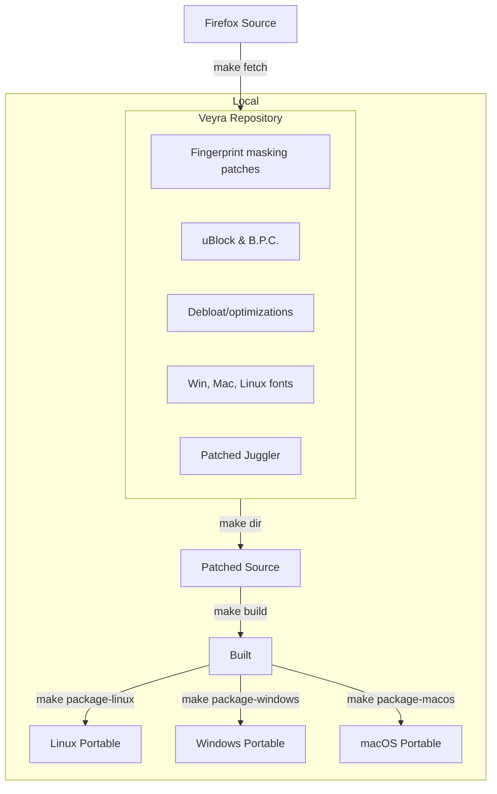
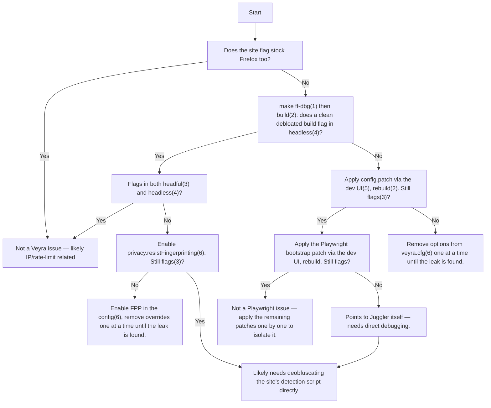

<h1 align="center">Veyra</h1>

<h4 align="center">A Firefox-based browser engineered to run undetected — built for scraping, automation, and AI agents.</h4>

<div align="center">
  <h4>⚠️ Under active development — not yet recommended for stable production use. ⚠️</h4>
</div>

---

## Quick start

```bash
pip install veyra-browser
python3 -m veyra fetch
```

```python
from veyra.sync_api import Veyra

with Veyra() as browser:
    page = browser.new_page()
    page.goto("https://example.com")
```

Async works the same way:

```python
from veyra.async_api import AsyncVeyra

async with AsyncVeyra() as browser:
    page = await browser.new_page()
    await page.goto("https://example.com")
```

Existing Playwright code needs essentially no changes — swap the browser launcher and keep everything else.

---

## The problem this solves

Every browser session leaks a fingerprint: OS, GPU, screen size, fonts, timezone, installed voices, WebRTC-visible IPs, and hundreds of smaller signals. Rotating IPs alone doesn't hide any of that. Anti-bot systems correlate these signals, and any single inconsistency — a Windows user agent paired with a Linux-only GPU string, for instance — is enough to get flagged, even from a clean residential IP.

Two things have to be true simultaneously for a spoofed identity to survive scrutiny:

1. **The values have to look statistically real.** Not just plausible individually, but drawn from the same distribution real devices actually show up in — if 5% of real traffic is Linux, your fleet should look like 5% Linux, not 50%.
2. **The values have to be internally consistent.** Every one of those signals has to agree with every other one, because a mismatch is far easier to detect than any single fake value.

Veyra handles the first with [BrowserForge](https://github.com/daijro/browserforge), a fingerprint generator trained on real-world device distributions. It handles the second by generating a complete, coherent identity per session rather than patching properties independently.

---

## How the spoofing actually holds up

Most fingerprint-spoofing tools inject JavaScript to overwrite `navigator` properties, `WebGLRenderingContext` methods, and similar. This has a structural weakness: JavaScript can't touch everything (network-level headers, for one), and anything JavaScript *can* touch, JavaScript can also be used to detect — `Object.getOwnPropertyDescriptor` reveals overridden properties, `Function.prototype.toString()` no longer returns `[native code]` on a hooked function, and values read from the main thread can be checked against a worker thread for consistency.

Veyra avoids this category of problem by not doing it that way. Spoofed values are intercepted at the C++ implementation level, inside the browser itself — the properties a page reads back are the real, native ones, because they *are* the real code paths, just returning different data. There's no JavaScript override to fingerprint.

The same approach applies to automation detection. Firefox's automation layer (Juggler, the Firefox equivalent of Chrome's DevTools Protocol) normally injects trace code into the page — things like `window.__playwright__binding__` — for element queries, script evaluation, and init scripts. Veyra's patched Juggler runs all of that in an isolated scope the page never sees, working against its own private copy of the page rather than the real one. Nothing in the page context observes automation ever happened.

Two more details worth knowing:

- **Headless mode is patched to look identical to a normal window.** If a target still manages to distinguish it, the Python library can fall back to a real (virtual) display buffer rather than headless mode.
- **Mouse movement is human-modeled, not just non-linear.** The underlying algorithm ([riflosnake/HumanCursor](https://github.com/riflosnake/HumanCursor)) was ported to C++ and extended for distance-aware trajectories, since click/scroll/movement timing is itself a signal anti-bot systems watch.

None of this is a silver bullet — spoofing thousands of interdependent data points without a single inconsistency is genuinely hard, and this is an active, ongoing effort rather than a solved problem. Chromium fingerprints specifically aren't supported: some WAFs probe for SpiderMonkey-specific engine behavior that can't be faked from inside a Gecko-based browser.

---

## What's spoofed

| Category | Coverage |
|---|---|
| Identity | Full `navigator` surface — device, OS, hardware, browser build |
| Display | Screen size, resolution, inner/outer viewport dimensions |
| Graphics | WebGL parameters, extensions, context attributes, shader precision |
| Audio | AudioContext sample rate/latency/channel count, voice list, playback rates |
| Devices | Reported microphone/camera/speaker counts |
| Network | WebRTC IP leakage at the protocol level; Accept-Language/User-Agent headers matched to the spoofed identity |
| Locale | Geolocation, timezone, locale, and `Intl` all derived consistently |
| Fonts | Correct system font set per spoofed OS, with metrics offset to defeat font-fingerprinting |
| Misc | Battery API, and more |

Beyond spoofing, the browser itself is stripped down: most Mozilla telemetry/services are disabled outright, patches from LibreWolf and Ghostery remove tracking and bloat, CSS animations are off, and the result runs noticeably lighter than stock Firefox (roughly 200MB at idle).

Addons load without a debug server (just pass a list of paths), come pre-bundled with a privacy-tuned uBlock Origin, can't spontaneously open new tabs, and are auto-enabled in private browsing.

The Python layer does the identity generation itself: it derives geolocation/timezone/locale from your proxy's actual target region (rather than the machine's own), weights browser language by regional speaker distribution, injects and rotates WebGL fingerprints, can run a remote Playwright-compatible server, and lets you toggle images/WebRTC/WebGL per session.

---

## Building from source

Requires Linux (native builds; Windows and macOS targets are cross-compiled from Linux). WSL is not supported for the native path.

```bash
git clone --depth 1 https://github.com/ahansardar/veyra
cd veyra
bash scripts/install-deps.sh   # host build deps: Python 3.11+, Rust, aria2, p7zip, go, msitools, sqlite
make dir                       # fetch Firefox source, apply the patch stack
make bootstrap                 # one-time: installs the Mozilla toolchain (clang, rustup targets, etc.)
python3 multibuild.py --target linux windows macos --arch x86_64 arm64 i686
```

`i686` is only supported as a Windows target; unsupported target/arch combinations are skipped automatically. Built artifacts land in `dist/`.

<details>
<summary>Full CLI options</summary>

```
Options:
  -h, --help            show this help message and exit
  --target {linux,windows,macos} [{linux,windows,macos} ...]
                        Target platforms to build
  --arch {x86_64,arm64,i686} [{x86_64,arm64,i686} ...]
                        Target architectures to build for each platform
  --bootstrap           Bootstrap the build system
  --clean               Clean the build directory before starting
```

</details>

### Building in Docker instead

```bash
docker build -t veyra-builder .
docker run -v "$(pwd)/dist:/app/dist" veyra-builder --target <os> --arch <arch>
```

<details>
<summary>Reusing a host ~/.mozbuild cache</summary>

```bash
docker run \
  -v "$HOME/.mozbuild":/root/.mozbuild:rw,z \
  -v "$(pwd)/dist:/app/dist" \
  veyra-builder \
  --target <os> \
  --arch <arch>
```

</details>

### Working on patches

```bash
make edits
```

opens a developer UI for applying, editing, and writing patches against a live checkout — reset the workspace, make your change under `veyra-*/`, verify with `make build && make run`, then write the workspace back to a patch file.

### Architecture, briefly



The build system's debloat/patch-management approach traces back to LibreWolf's.

---

## Diagnosing a leak

If a target site flags a request and it's not obviously rate-limiting or a bad IP, the general approach is to reintroduce Veyra's patches into a clean Firefox checkout one layer at a time until the flag reappears — narrowing down which specific patch (or config value) is responsible, without needing to deobfuscate the target's detection script.

<details>
<summary>Full decision flow</summary>



| # | Command | What it does |
|---|---|---|
| (1) | `make ff-dbg` | Sets up vanilla Firefox with a minimal patch set |
| (2) | `make build` | Builds the source |
| (3) | `make run` | Runs the built browser |
| (4) | `make run args="--headless https://test.com"` | Runs a URL headless; redirects print to console |
| (5) | `make edits` | Opens the patch-management developer UI |
| (6) | `make edit-cfg` | Opens `veyra.cfg` in your default editor |

</details>

---

## License

MPL 2.0 — see [LICENSE](LICENSE).
